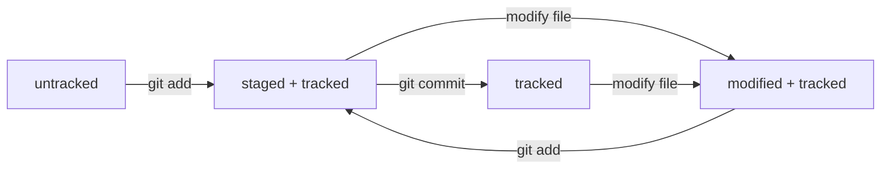

###### Приветствую! В данном файле собраны небольшие шпаргалки по разным темам из курса обучения.


### Загрузка и установка Git Bash на Windows.

1. Перейти по ссылке [Git](https://git-scm.com/install/windows).
2. Выбрать подходящий дистрибутив и Загрузить.
3. Запустить инсталлятор и Проверить путь установки (изменить, если дефолтный вариант не подходит).
4. Проверить, что включена опция "Git Bash Here" на вкладке с выбором компонентов "Select Components" (эта опция позволит запускать консоль из любой папки).
5. Остальные опции рекомендуется оставить по умолчанию.

> Мы успешно установили Git Bash!


### Инициализация локального репозитория.

1. Запустите Git Bash (Поиском или Запустить из папки Git в списке всех программ меню Пуск).
2. Узнаем в какой директории по умолчанию открылся Bash.
3. Используем команду "pwd" (от англ. present working directory).
4. Теперь перейдём в директорию, где будет инициализирован репозиторий.
Переходим в папку с помощью команды "cd <Путь к папке>" (от англ. change directory).
К примеру, "cd /c/Users/<Current User>/<Project\_Folder>".
5. Создаём папку для репозитория с помощью команды "mkdir" (от англ. make directory).
К примеру, "mkdir First\_Project".
6. Переходим в созданную директорию с помощью команды "cd <Имя созданной папки>".
7. Инициализируем репозиторий с помощью команды "git init".

> Репозиторий инициализирован. Должно отобразиться сообщение об успешной инициализации пустого репозитория. 

В директории проекта должна появиться папка .git (папка скрыта, чтобы её увидеть нужно поменять настройку отображения скрытых папок в Проводнике).


### Деинициализация репозитория (к примеру, по ошибке сделали не в той папке).

Для того, чтобы деинициализировать репозиторий, нужно удалить подпапку ".git".

1. Удалить из UI Проводника.
Либо
2. Удалить из Git Bash командой "rm -rf .git" (rm - remove, r - удаление всех подпапок и файлов внутри папки,
f - убирает вопросы "Уверены, что хотите удалить" перед удалением внутренних файлов и папок).


### Хеширование


Хеширование - способ преобразования данных для получения их отпечатка.

Обычно хеш - это короткая строка (в случае SHA-1 - 40 символов), состоящая из набора цифр 0 - 9 и латинских букв A - F.
У данной строки есть два важных свойства:

* Хеш для одного и того же набора данных гарантированно не меняется.
* Если изменить в наборе данных хотя бы один символ, то хеш сильно изменится.

Для экспериментов можно использовать [сайт](https://emn178.github.io/online-tools/sha1.html).


Для чего хеширование в Git?


* Git использует хеширование для создания индивидуального идентификатора для каждого коммита в репозитории.
* По хешу можно узнать автора коммита, время, дату создания и содержимое закоммиченных файлов.
* Все хеши собираются в таблицу соответствия хеш -> информация о коммите. Эта таблица хранится в репозитории в скрытой папке .git.


### git log


В данном разделе разберём какую информацию отображает команда "git log".
Для начала приведём пример, к примеру последний коммит в текущий репозиторий.


```bash
$ git log
commit c5cfd8dfec1bb5ab21b6daa4cfdb82a560e396c1 (HEAD -> master, origin/master, origin/HEAD)
Author: VladimirM <mazh95@yandex.ru>
Date:   Fri Apr 24 18:59:05 2026 +0300

    Добавить информацию про хеширование
```


Пойдём по строчкам:

1. В первой строке отображается хеш коммита (информация про хеш чуть выше). Это уникальный идентификатор коммита.  
В скобочках первой строки указана информация о том, что HEAD (голова) указывает на текущий коммит (по умолчанию это последний коммит в ветке).  
Про HEAD мы поговорим подробнее в следующих разделах.
2. Author - информация об авторе коммита. Во время настройки Git данную информацию можно указать в git config файле:
git config --global user.name "Имя пользователя"
git config --global user.email "email пользователя"
3. Время и дата коммита.
4. Наименование коммита - это сообщение, которое вы добавляете после параметра -m.


###### Сокращённый git log --oneline


В Git Bash есть возможность вывести сокращённый лог. Это полезно, когда репозиторий уже достаточно большой и содержит большое количество коммитов.
Так же разберём на примере последнего коммита.


```bash
$ git log --oneline
c5cfd8d (HEAD -> master, origin/master, origin/HEAD) Добавить информацию про хеширование
```

В данном случае информация о каждом коммите предоставляется в одну строчку:

1. Сокращённый хеш коммита - Git сокращает уникальные хеши каждого коммита так, чтобы они не теряли своей уникальности в репозитории.
2. Сообщения к коммиту после параметра -m.


### HEAD


* HEAD это служебный файл папки .git. Его можно найти и открыть из консоли или из проводника.
По умолчанию в нём будет находится ссылка на служебный файл refs/heads/master (либо refs/heads/main).
Если открыть refs/heads/master, то в нём будет храниться хеш последнего коммита.
После каждого коммита Git обновляет refs/heads/master, а следовательно и HEAD.
* HEAD можно передавать Git вместо хеша последного коммита. Git самостоятельно пройдёт по ссылкам и возьмёт хеш.


### Статусы файлов в Git

Всего в Git существует 4 статуса. Давайте познакомимся с каждым из них:

* Untracked - данный статус получают файлы, которые на отслеживаются Git, но Git знает о их существовании.  
К примеру, мы создали в репозитории новый файл "NewTxt.txt". Это новый файл, Git не следит за ним, но видит его в репозитории.
* Staged - после выполнения команды "git add" файл попадает в staged area, т.е. файл подготовлен к коммиту.
* Tracked - после выполнения команд "git commit" или "git add" файлу присваивается статус Tracked, т.е. Git знает и следит за версионностью файла.
* Modified - данный статус появляется у отслеживаемых файлов, в которых произошли изменения в сравнении с последней версией.


Staged и Modified
Интересный кейс с данными статусами файлов.
Если, к примеру, выполнить команду git add, то файл с изменениями попадёт в staged area и получит статус staged. Если следом до коммита сделать новые изменения в файле, то данная версия получит статус modified. Чтобы снова добавить файл в staged нужно повторить команду git add.

Опишем схему изменения статусов файлов:




### Советы по сообщениям коммитов

В каждой команде или компании существует свой стиль сообщений коммитов. Выделим основные отличия хорошего сообщения о коммите (после параметра -m):
* Сообщение коммита хорошо читается.
* Сообщение информативное.
* Все сообщения в одном стиле.
Чем раньше в репозитории установится единый стиль сообщений тем читабильнее и информативнее будет история коммитов.
